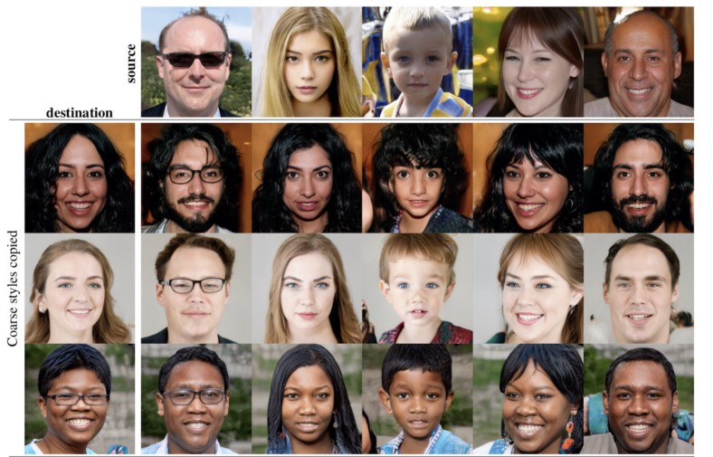

## Style-Mixing with real images using StyleGAN2




**AmirHossein Bayat and Melika Emami**<br>

Paper: http://arxiv.org/abs/1912.04958<br>
Video: https://youtu.be/c-NJtV9Jvp0<br>

For any inquiries, please contact us through github<br>

## License

Copyright &copy; 2019, NVIDIA Corporation. All rights reserved.

This StyleGAN2 is made available under the Nvidia Source Code License-NC. To view a copy of this license, visit https://nvlabs.github.io/stylegan2/license.html

## Citation

```
@article{Karras2019stylegan2,
  title   = {Analyzing and Improving the Image Quality of {StyleGAN}},
  author  = {Tero Karras and Samuli Laine and Miika Aittala and Janne Hellsten and Jaakko Lehtinen and Timo Aila},
  journal = {CoRR},
  volume  = {abs/1912.04958},
  year    = {2019},
}
```

## Acknowledgements

We thank Tero Karras, Samuli Laine, Miika Aittala, Janne Hellsten, Jaakko Lehtinen and Timo Aila for their excellent work.
